# Results For the Q1: Concurrent Trie

## Performace Metrics: 
#
1) ### Number of concurrent threads
    #
    ### Workload and tester configuration for test:  
    - A single file is generated for all the operations(find/pref/insert/delete). The idea is to keep the workload constant and increase the number of threads on the same workload. 

    - Upto 100 concurrent threads

    - The number of unique aplhabets are 9 (a to i) 

    - The Trie Size is 6. Therefore maximum size of any string inserted is 6. 

    - The number of entries in the file are 500000. These number of entries ensure that all the possible strings of above configuration will be present in the generated workload. 

    - All the threads read from a single file descriptor          concurrently. Note, since read operation is atomic, we do not need any locks while reading, but when we insert, then we have to read a string and a number from the file, therefore 2 reads are required in a method. Hence, we need to use a lock there to avoid any mishap. 

    Read Intensive             |  Read Intensive cumulative averaged
    :-------------------------:|:-------------------------:
    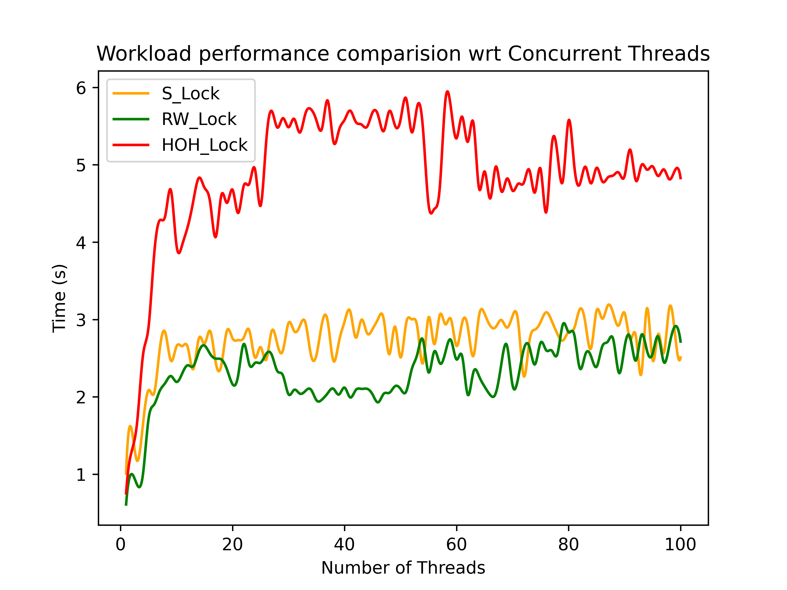  |  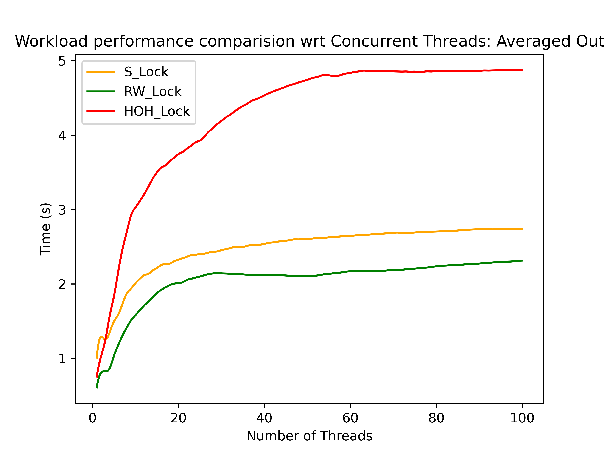

    #
    - For read intensive task I used the 80-20 model, with 4 find operations and 1 insert operation. After observing the results, we find that the reader writer lock performs the best in the condition. And HOH locks perform the worst.  
    
    - The reason for the bad performance of HOH locks are the overhead of having so many locking and unlocking operation for each node. The overhead outplay the other factors. 

    - The reader-writer locks are multi-reader locks, and they allow multiple threads to concurrently access read. Therefore the reader-writer lock performs the best in this scenario. 

    - The reason for the saturation of the graph is that the workload is constant for every iteration. That is for 1 thread the workload is same and for 100 threads also, the workload is same. However, when the number of threads increase a lot, the cost of context switches also dominate, as a lot of context switches occur. 

    - In conclusion, we see the results that were theoritically expected in this case, with reader-writer performing the best. 
    
    #
    Write Intensive             |  Write Intensive cumulative averaged
    :-------------------------:|:-------------------------:
    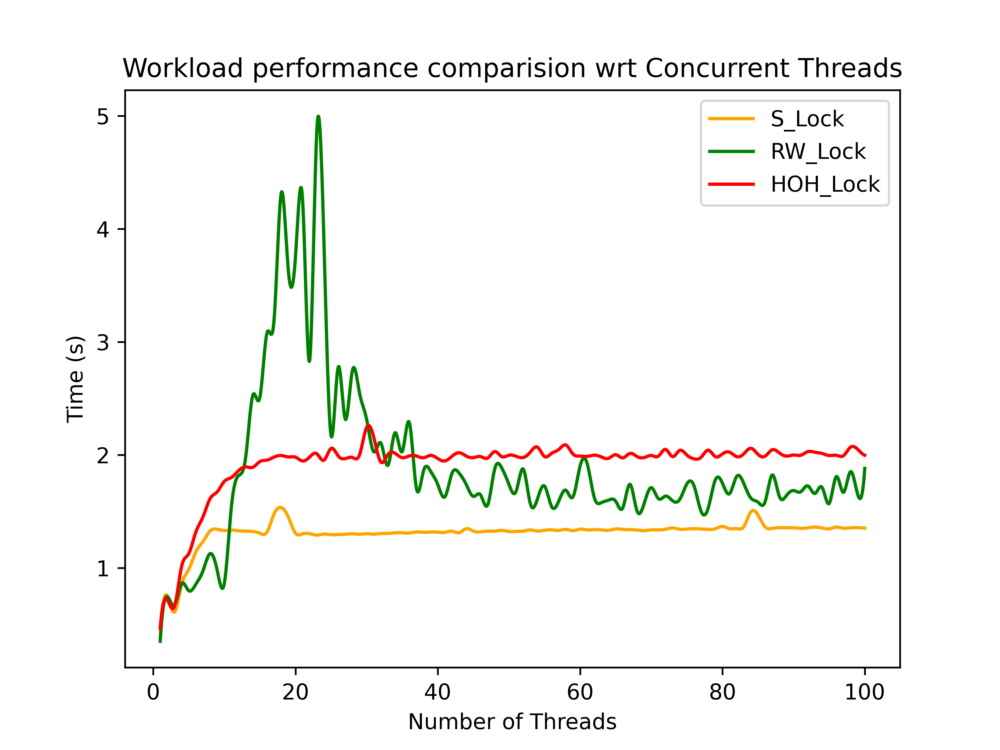  |  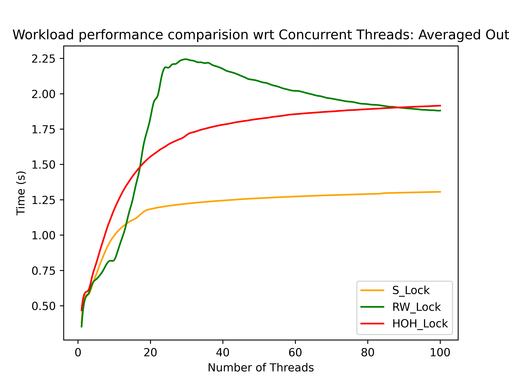

    - For write intensive task I used the 2 insert operations. After observing the results, we find that initially all the locks performs almost the same, how ever eventually, the single lock performs the best and the HOH lock performs the worst. 
    
    - The reason for the bad performance of HOH locks are the overhead of having so many locking and unlocking operation for each node. The overhead outplay the other factors. 

    - The reader-writer locks are multi-reader locks, but allow only single write lock access. Therefore the reader-writer lock eventually performs similar to the single lock. 

    - The single lock works the best in this case because there is least overhead in case of the single lock, as compared to other locking mechanisms.  

    - The reason for the saturation of the graph is that the workload is constant for every iteration. That is for 1 thread the workload is same and for 100 threads also, the workload is same. However, when the number of threads increase a lot, the cost of context switches also dominate, as a lot of context switches occur. 

    - In conclusion, we expected that the reader-writer locks will eventually perform similar to single locks. And that is the case here. However, the HOH lock due to the over head of havig a lot of locks, performs the worst. 

    Mixed Read & Write workload [50-50]|  Mixed Read & Write workload [50-50] cumulative averaged
    :-------------------------:|:-------------------------:
    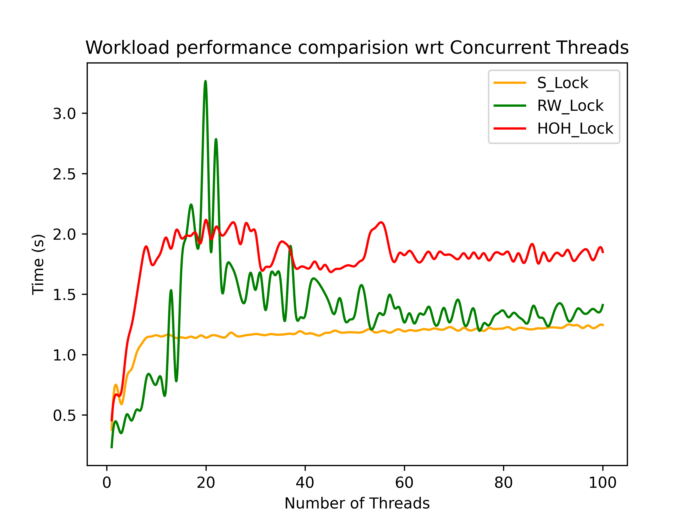  |  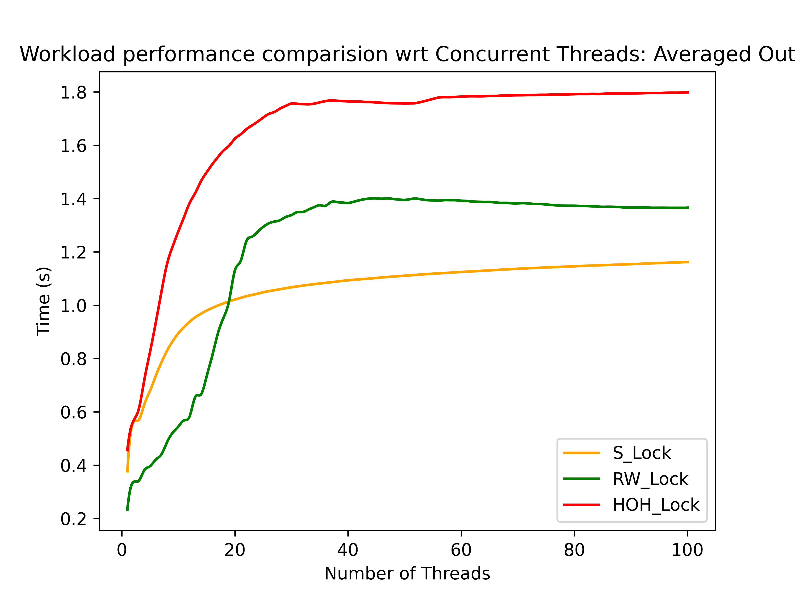

    - For 50-50 task I used the ! insert operations and 1 find operation. After observing the results, we find that initially reader-writer performs the best and single lock and HOH perform almost the same, but eventually, the single lock and reader-writer lock performs almost the same. And HOH performs the worst. 
    
    - The reason for the bad performance of HOH locks are the overhead of having so many locking and unlocking operation for each node. The overhead outplay the other factors. 

    - The reader-writer locks are multi-reader, single writer locks. Therefore the reader-writer lock eventually performs similar to the single lock, balancing the overhead of locks, with multi-read factor. 

    - The single lock works the best in this case because there is least overhead in case of the single lock, as compared to other locking mechanisms.  

    - The reason for the saturation of the graph is that the workload is constant for every iteration. That is for 1 thread the workload is same and for 100 threads also, the workload is same. However, when the number of threads increase a lot, the cost of context switches also dominate, as a lot of context switches occur. 

    - In conclusion, we expected that the reader-writer locks will eventually perform similar to single locks. And that is the case here. However, the HOH lock due to the over head of havig a lot of locks, performs the worst. 
    This result is somewhere in between that of write intensive and read intensive workload. 
#
2) ### Size of the trie
    # 
    ### Workload and tester configuration for test:  
    - A single file is generated for all the operations(find/pref/insert/delete). The idea is to keep the workload constant and increase the number of threads on the same workload. 

    - Upto 100 concurrent threads

    - The number of unique aplhabets are 9 (a to i) 

    - The Trie Size is 6. Therefore maximum size of any string inserted is 6. 

    - The number of entries in the file are 500000. These number of entries ensure that all the possible strings of above configuration will be present in the generated workload. 

    - All the threads read from a single file descriptor          concurrently. Note, since read operation is atomic, we do not need any locks while reading, but when we insert, then we have to read a string and a number from the file, therefore 2 reads are required in a method. Hence, we need to use a lock there to avoid any mishap. 
    
    Read Intensive             |  Read Intensive cumulative averaged
    :-------------------------:|:-------------------------:
    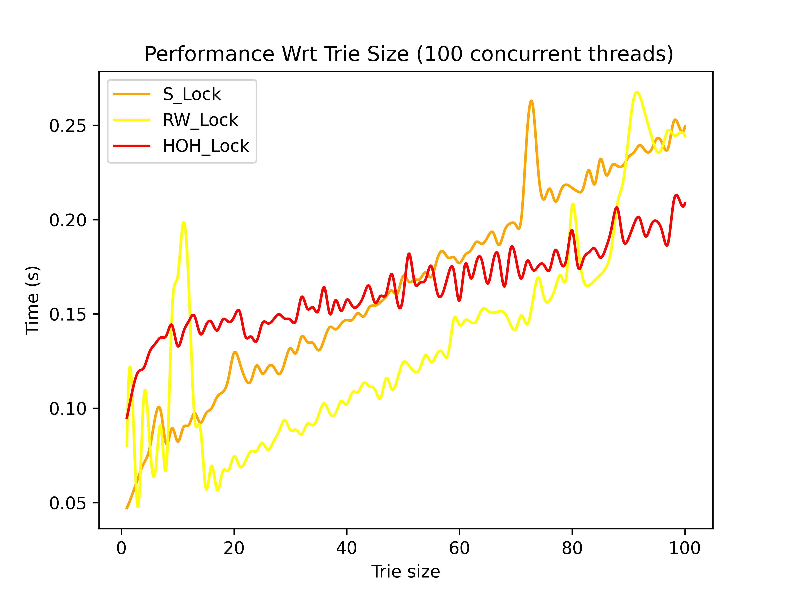  |  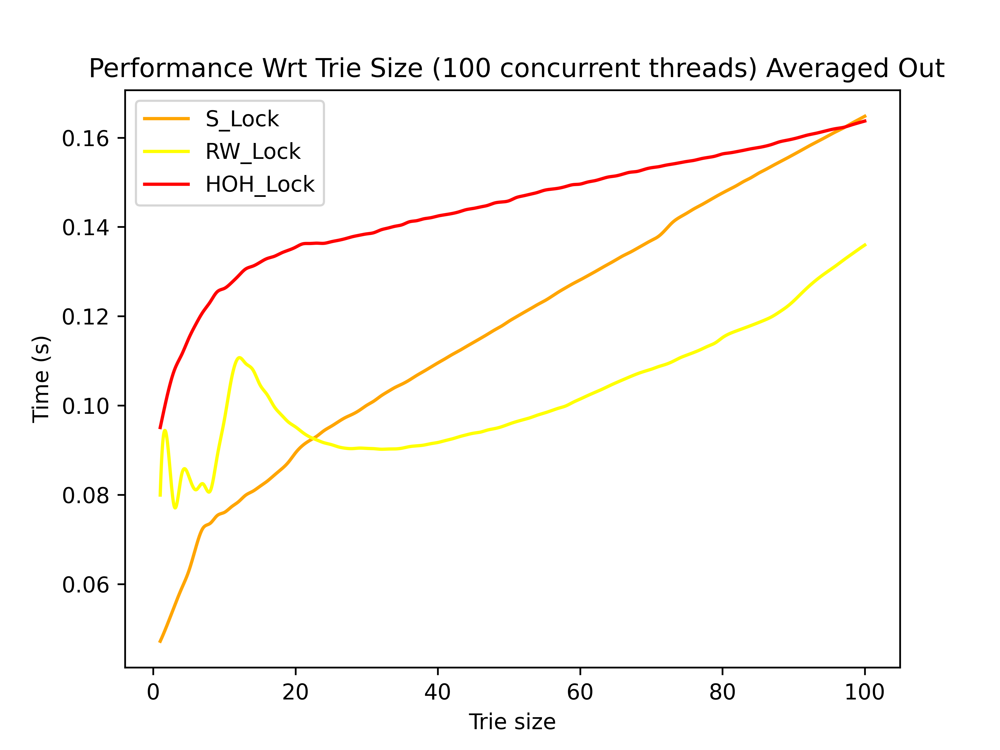

    
    Write Intensive             |  Write Intensive cumulative averaged
    :-------------------------:|:-------------------------:
    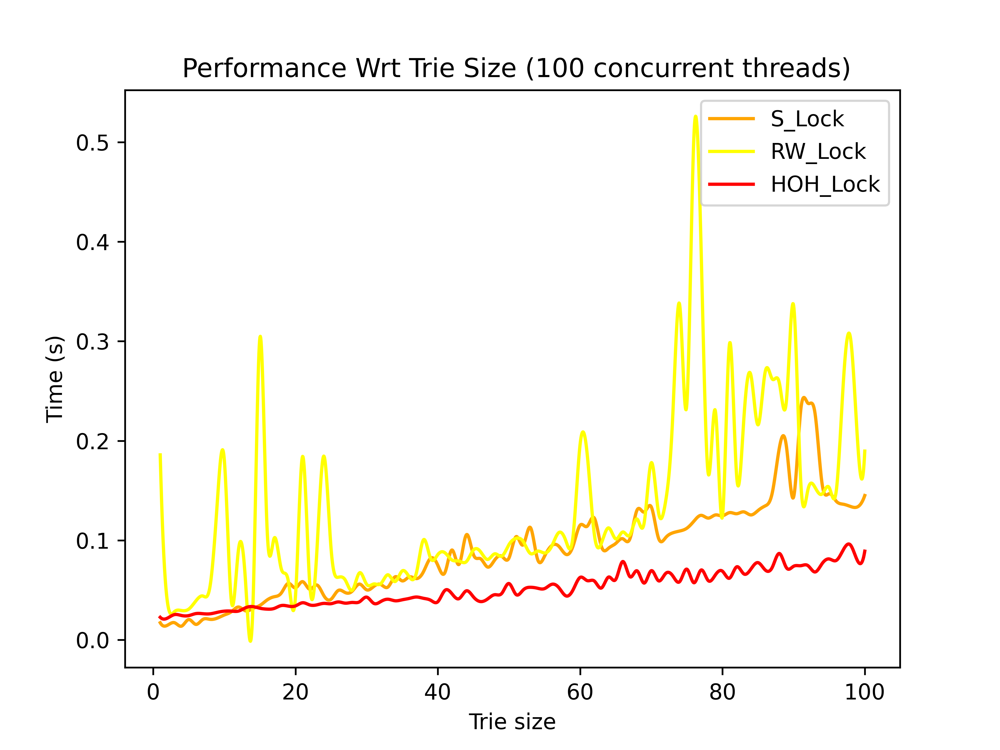  |  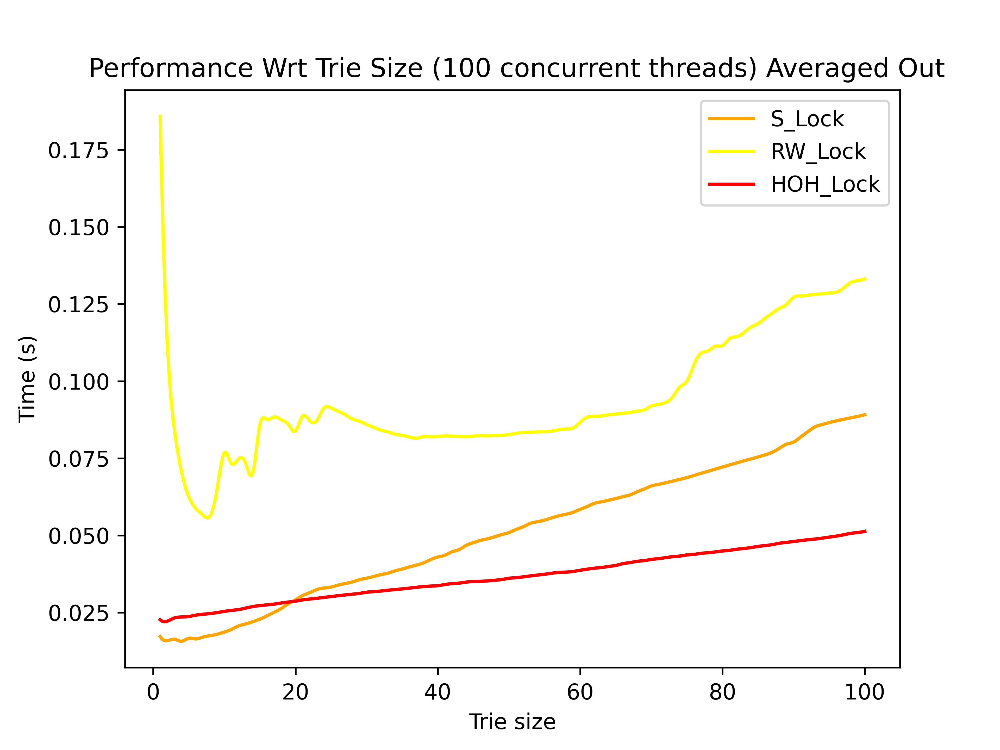

    Mixed Read & Write workload|  Mixed Read & Write workload cumulative averaged
    :-------------------------:|:-------------------------:
    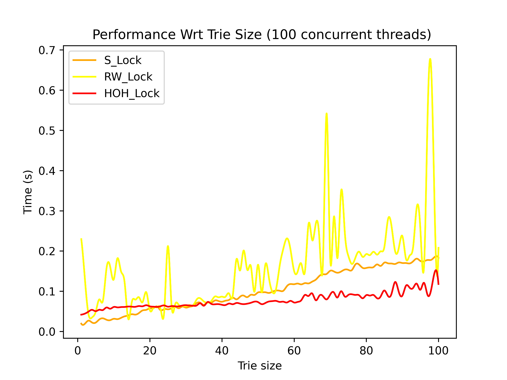  |  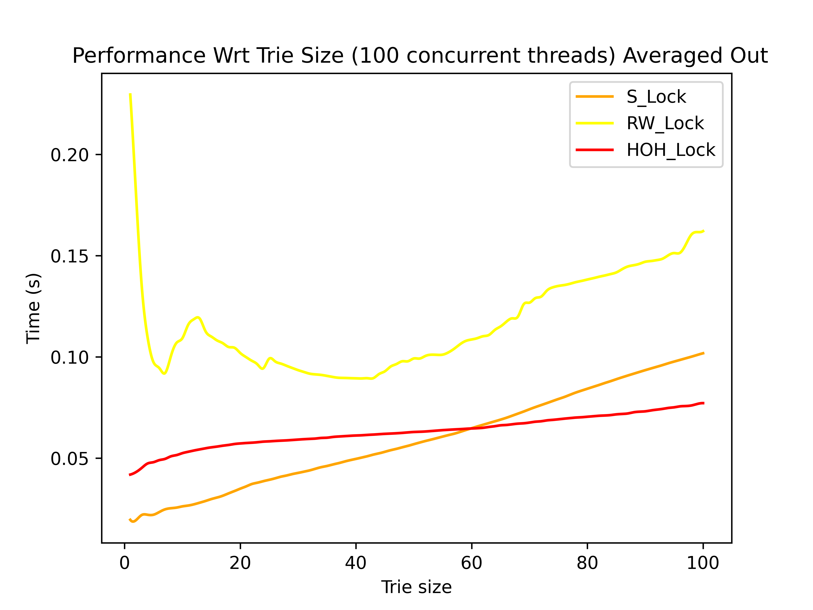