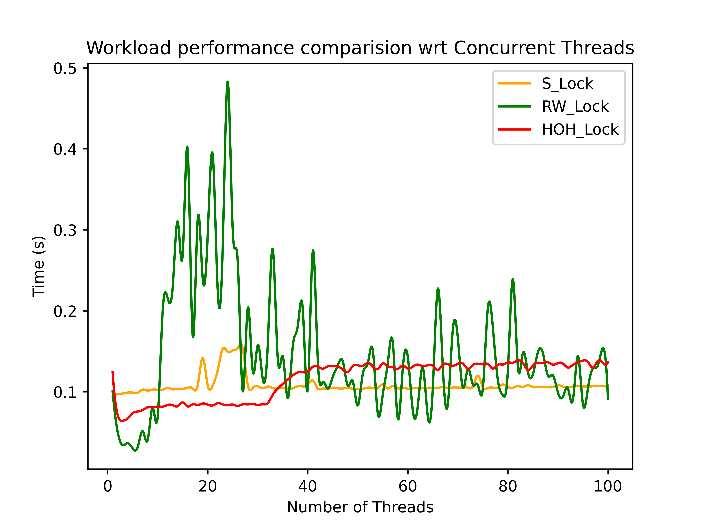
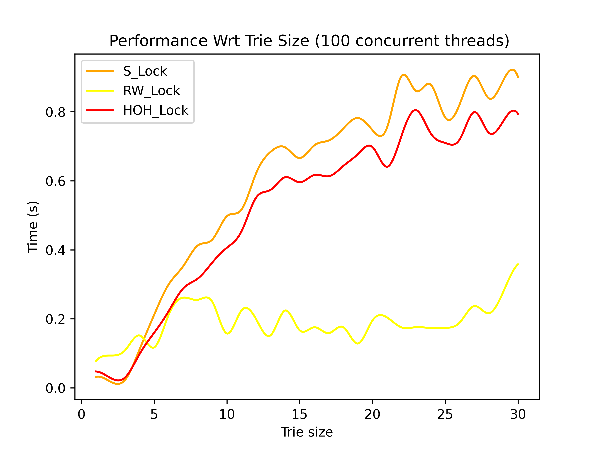

# Results For the Q1: Concurrent Trie

## Performace Metrics: 

1) ### Number of concurrent threads

    - Mixed Read / Write workload (50%-50%)
    
    - Write intensive workload
    
    - Read intensive workload
    

2) ### Size of the trie

    - Mixed Read / Write workload (50%-50%)
    
    - Write intensive workload
    
    - Read intensive workload
    