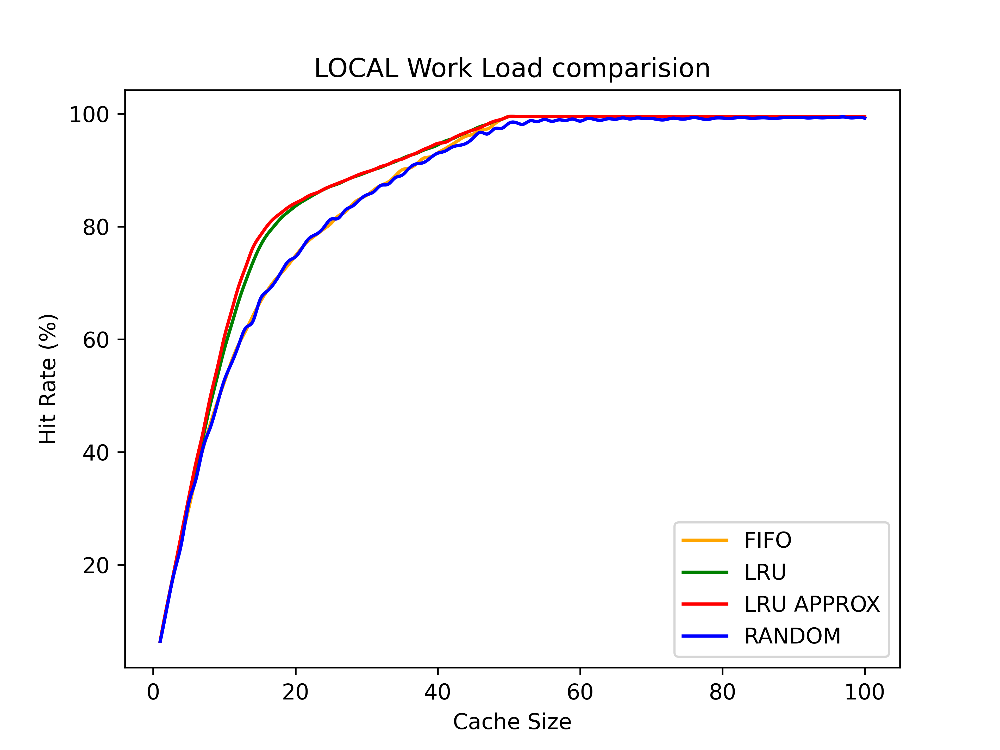
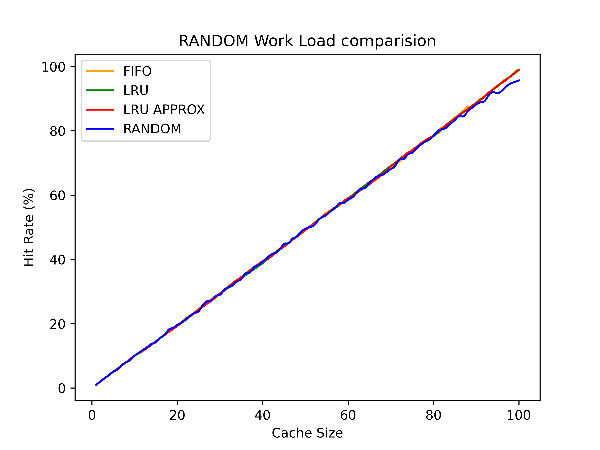
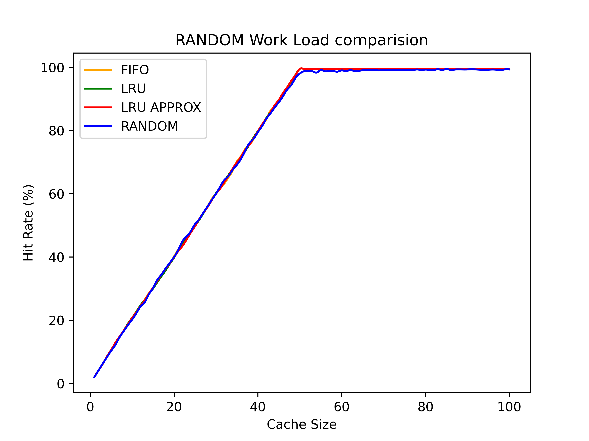
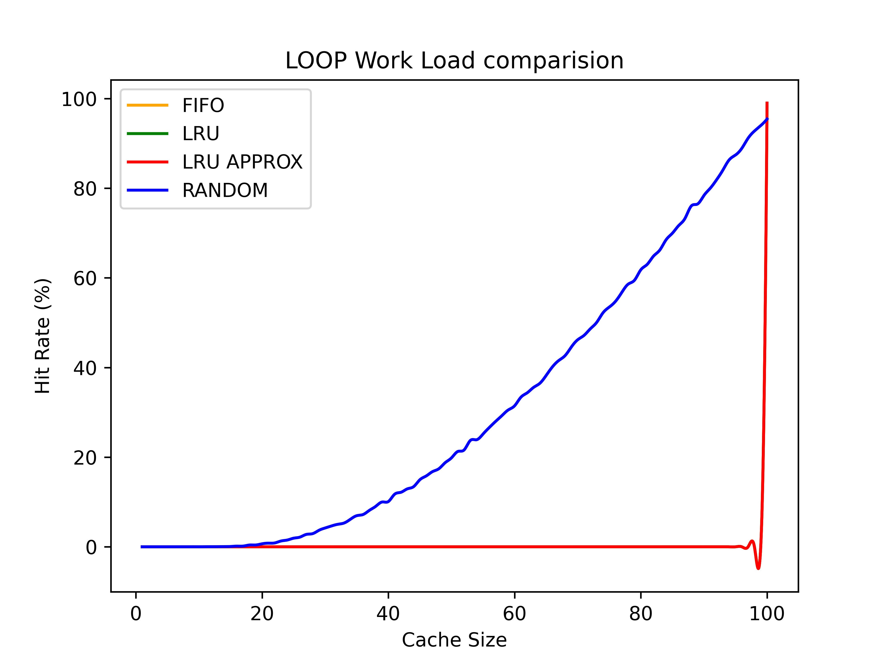
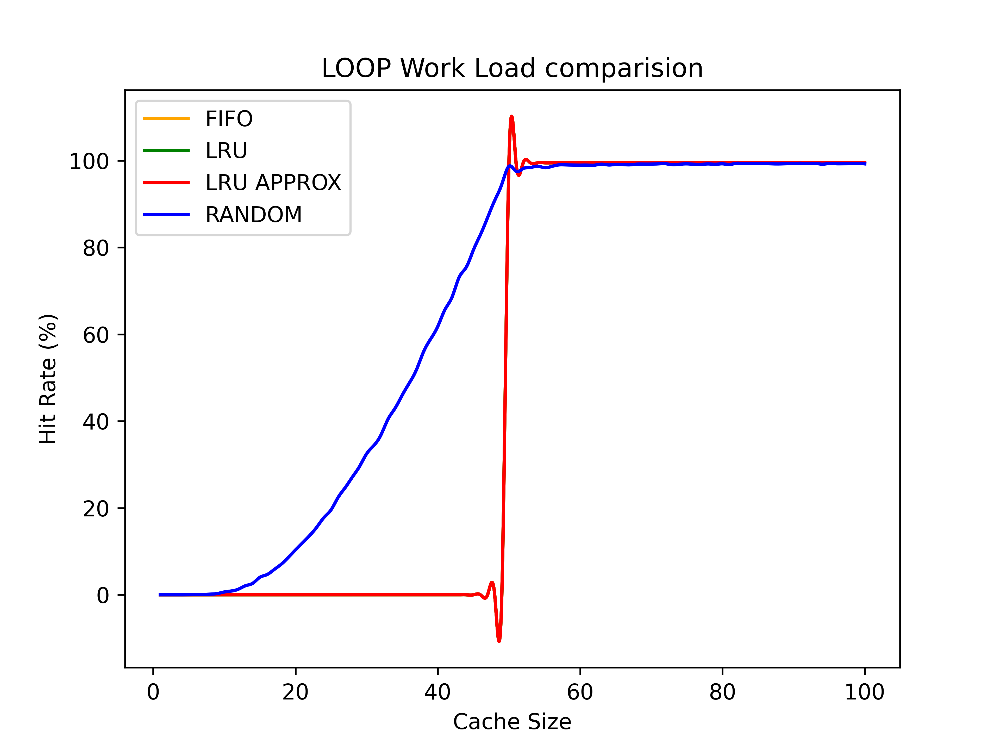

# Results For the Q2: Different Caching Policies and Workload Generation

## Performace Metrics: 

1) ## 80-20

    - ### Cache_Size = 100, Size = 10,000 , Pages = 100
    #
    
    #
    - ### Cache_Size = 100, Size = 10,000 , Pages = 50
    #
    
    #
2) ## Random

    - ### Cache_Size = 100, Size = 10,000 , Pages = 100
    #
    
    #
    - ### Cache_Size = 100, Size = 10,000 , Pages = 50
    #
    
    #
2) ## Looping

    - ### Cache_Size = 100, Size = 10,000 , Pages = 100
    #
    
    - ### Cache_Size = 100, Size = 10,000 , Pages = 50
    #
    

##  Time Complexity and Space Complexity Analysis Of Various Scheduling Policies wrt Data Structures 

1) ### FIFO: 
    - Using an array based queue data structure, with space       complexity of O(cache_size)
    - A cicular pointer representing the head of the queue, for mimicing the pop from FIFQ queue
    - Insert at the ith index & lookup : O(1) Time complexity
    - For every page, takes O(cache_size) time to find it in the queue
    - Total Time complexity: O(size*cache_size)

2) ### LRU:
    - Array based 2d queue one to maintain the page value. The second one is used to maintain the priority. 
    - Space complexity: O(cache_size)
    - Insert at the ith index & lookup : O(1) Time complexity
    - For every page, takes O(cache_size) to find and replace if necessary
    - Overall time complexity: O(size*cache_size)

3) ### LRU Approx: 
    - Array based 2d queue one to maintain the page value. The second one is used to maintain the second chance flag
    - Space complexity: O(cache_size)
    - Insert at the ith index & lookup : O(1) Time complexity
    - For every page, takes O(cache_size) to find and replace if necessary
    - Overall time complexity: O(size*cache_size)
4) ### Random: 
    - Using an array based queue data structure.
    - space complexity of O(cache_size)
    - Insert at the ith index & lookup : O(1) Time complexity
    - For every page, takes O(cache_size) time to find it in the queue
    - Total Time complexity: O(size*cache_size)