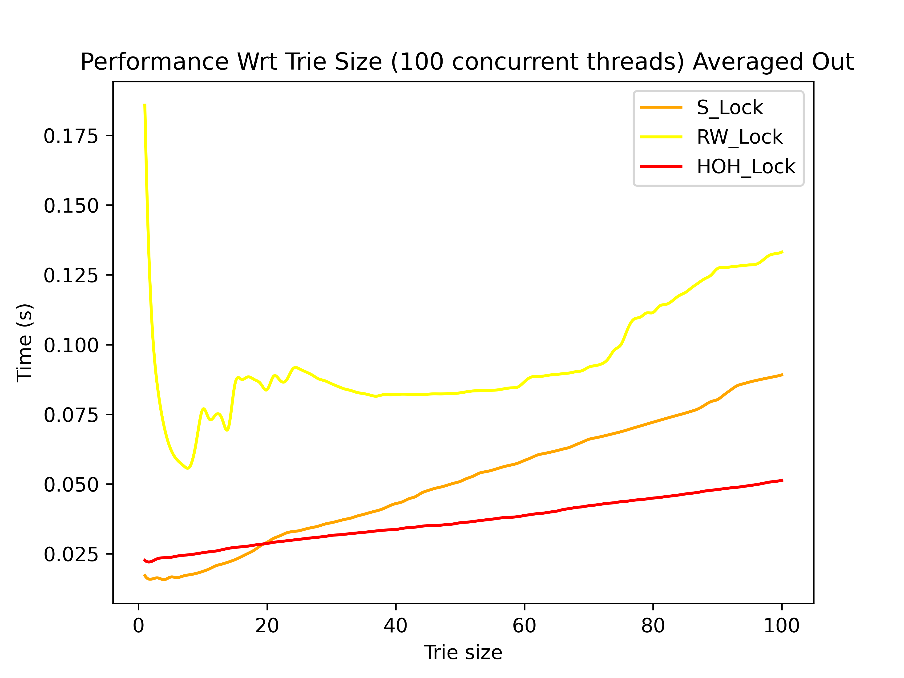

# Concurrent Trie ⭐

A concurrent Trie data structure with different locking mechanisms (Hand over Hand(HOH), Single lock, Reader-writer lock). 

## Directory Structure 📁

```
Concurrent-Trie
├─ common_threads.h
├─ Makefile
├─ metrics_tests
│  ├─ number_of_threads
│  │  ├─ common_tests.c
│  │  ├─ data
│  │  │  ├─ nthreads_hoh_lock.csv
│  │  │  ├─ nthreads_rw_lock.csv
│  │  │  └─ nthreads_s_lock.csv
│  │  ├─ hoh_lock
│  │  ├─ hoh_lock_test_metrics.c
│  │  ├─ Makefile
│  │  ├─ plot.py
│  │  ├─ plot2.py
│  │  ├─ plots
│  │  │  ├─ nthreads_comp_50-50.png
│  │  │  ├─ nthreads_comp_avg_50-50.png
│  │  │  ├─ nthreads_comp_avg_read.png
│  │  │  ├─ nthreads_comp_avg_write.png
│  │  │  ├─ nthreads_comp_read.png
│  │  │  └─ nthreads_comp_write.png
│  │  ├─ rw_lock
│  │  ├─ rw_lock_test_metrics.c
│  │  ├─ s_lock
│  │  ├─ s_lock_test_metrics.c
│  │  └─ workload_gen.py
│  └─ trie_size
│     ├─ common_tests.c
│     ├─ data
│     │  ├─ nthreads_hoh_lock.csv
│     │  ├─ nthreads_rw_lock.csv
│     │  └─ nthreads_s_lock.csv
│     ├─ hoh_lock
│     ├─ hoh_lock_test_metrics.c
│     ├─ Makefile
│     ├─ plot.py
│     ├─ plot2.py
│     ├─ plots
│     │  ├─ size_comp_50-50.png
│     │  ├─ size_comp_Avg_50-50.png
│     │  ├─ size_comp_Avg_read.png
│     │  ├─ size_comp_Avg_write.png
│     │  ├─ size_comp_read.png
│     │  └─ size_comp_write.png
│     ├─ rw_lock
│     ├─ rw_lock_test_metrics.c
│     ├─ s_lock
│     ├─ s_lock_test_metrics.c
│     └─ workload_gen.py
├─ plots.md
├─ README.md
├─ tests
│  ├─ multi_thread
│  │  ├─ find
│  │  │  ├─ 1.txt
│  │  │  ├─ 2.txt
│  │  │  ├─ 3.txt
│  │  │  ├─ exp_find_1.txt
│  │  │  ├─ exp_find_2.txt
│  │  │  └─ exp_find_3.txt
│  │  ├─ initial
│  │  │  ├─ 1.txt
│  │  │  ├─ 2.txt
│  │  │  ├─ 3.txt
│  │  │  └─ exp_ins.txt
│  │  ├─ pref
│  │  │  ├─ 1.txt
│  │  │  ├─ 2.txt
│  │  │  ├─ 3.txt
│  │  │  ├─ exp_1.txt
│  │  │  ├─ exp_2.txt
│  │  │  └─ exp_3.txt
│  │  └─ rem
│  │     ├─ 1.txt
│  │     ├─ 2.txt
│  │     ├─ 3.txt
│  │     └─ exp.txt
│  └─ single_thread
│     ├─ exp_ins.txt
│     ├─ exp_rem.txt
│     ├─ find_test.txt
│     ├─ find_test_exp.txt
│     ├─ initial.txt
│     ├─ pref_text.txt
│     ├─ pref_text_exp.txt
│     └─ rem_list.txt
├─ trie.c
└─ trie.h

```

## Feature Checklist ✅
```
✅ Concurrent trie data structure
✅ With Autocomplete(prefix match), Insert, Find, Delete Key and Delete Trie. 
✅ Single lock mechanism 
✅ Hand Over Hand (HOH) lock mechanism 
✅ Reader-Writer lock mechanism 
✅ Automated load generation and testing scripts
✅ Valgrind and helgrind memory and concurrency report
✅ Performance comparision of locking mechanisms accross different parameters: 
    - Number of concurrent threads
    - Different types of workload:
        1. Write intensive workload
        2. Read intensive workload
        3. Mixed Read / Write workload (50%-50%)
    - Size of the tree
```

## Instructions to Run 🏃

## Compiling the test code:
- **Single Threaded:** `make test_trie_single_threaded`
- **Multi Threaded (Single Locking):** `make test_trie_s_lock` 
- **Multi Threaded (R/W Lock):** `make test_trie_rw_lock`
- **Multi Threaded (Hand on Hand Lock):** `make test_trie_hoh_lock`


## Compiling and running the tests:
- **Single Threaded:** `make single_threaded`
- **Multi Threaded (Single Locking):** `make s_lock` 
- **Multi Threaded (R/W Lock):** `make rw_lock`
- **Multi Threaded (Hand on Hand Lock):** `make hoh_lock`

### Can also run `make` to compile and run all the tests automatically


## Benchmarking 🚦

### For benchmarking wrt number of threads, go to `Concurrent-Trie/metrics_tests/number_of_threads`. 

- Run `make workload` to generate the workload.
- Run `make build` to compile the files
- Run `make exec` to execute the compiled files. 
- Run `make plot` or `make plot2` to generate running averaged or non-averaged graphs.  
- Note: One can even run `make all` to do all the above steps. 


### For benchmarking wrt number of threads, go to `Concurrent-Trie/metrics_tests/trie_size`. 

- Perform the above steps to generate the plots/graphs. 


## Results and Conclusions 📊


### General Comment on the trend of RW lock performance graphs 🎉

Note that as we can see the graphs, the graph of reader-writer locks have quite a lot disturbance and there is usually a peak followed by a dip. This is because at the point ok peak, the reader-locks starve out the writer-lock. Therefore, the writing part starves for a long time. Also, the disurbance can also be explained by starving of the writer lock by the reader-locks. 
#
1) ### Number of concurrent threads ⚖
    #
    ### Workload and tester configuration for test:  
    - A single file is generated for all the operations(find/pref/insert/delete). The idea is to keep the workload constant and increase the number of threads on the same workload. 

    - Upto 100 concurrent threads

    - The number of unique aplhabets are 9 (a to i) 

    - The Trie Size is 6. Therefore maximum size of any string inserted is 6. 

    - The number of entries in the file are 500000. These number of entries ensure that all the possible strings of above configuration will be present in the generated workload. 

    - All the threads read from a single file descriptor concurrently. Note, since read operation is atomic, we do not need any locks while reading, but when we insert, then we have to read a string and a number from the file, therefore 2 reads are required in a method. Hence, we need to use a lock there to avoid any mishap. 

    Read Intensive             |  Read Intensive cumulative averaged
    :-------------------------:|:-------------------------:
      |  

    #
    - For read intensive task I used the 80-20 model, with 4 find operations and 1 insert operation. After observing the results, we find that the reader writer lock performs the best in the condition. And HOH locks perform the worst.  
    
    - The reason for the bad performance of HOH locks are the overhead of having so many locking and unlocking operation for each node. The overhead outplay the other factors. 

    - The reader-writer locks are multi-reader locks, and they allow multiple threads to concurrently access read. Therefore the reader-writer lock performs the best in this scenario. 

    - The reason for the saturation of the graph is that the workload is constant for every iteration. That is for 1 thread the workload is same and for 100 threads also, the workload is same. However, when the number of threads increase a lot, the cost of context switches also dominate, as a lot of context switches occur. 

    - In conclusion, we see the results that were theoritically expected in this case, with reader-writer performing the best. 
    
    #
    Write Intensive             |  Write Intensive cumulative averaged
    :-------------------------:|:-------------------------:
      |  

    - For write intensive task I used the 2 insert operations. After observing the results, we find that initially all the locks performs almost the same, how ever eventually, the single lock performs the best and the HOH lock performs the worst. 
    
    - The reason for the bad performance of HOH locks are the overhead of having so many locking and unlocking operation for each node. The overhead outplay the other factors. 

    - The reader-writer locks are multi-reader locks, but allow only single write lock access. Therefore the reader-writer lock eventually performs similar to the single lock. 

    - The single lock works the best in this case because there is least overhead in case of the single lock, as compared to other locking mechanisms.  

    - The reason for the saturation of the graph is that the workload is constant for every iteration. That is for 1 thread the workload is same and for 100 threads also, the workload is same. However, when the number of threads increase a lot, the cost of context switches also dominate, as a lot of context switches occur. 

    - In conclusion, we expected that the reader-writer locks will eventually perform similar to single locks. And that is the case here. However, the HOH lock due to the over head of havig a lot of locks, performs the worst. 

    Mixed Read & Write workload [50-50]|  Mixed Read & Write workload [50-50] cumulative averaged
    :-------------------------:|:-------------------------:
      |  

    - For 50-50 task I used 1 insert operations and 1 find operation. After observing the results, we find that initially reader-writer performs the best and single lock and HOH perform almost the same, but eventually, the single lock and reader-writer lock performs almost the same. And HOH performs the worst. 
    
    - The reason for the bad performance of HOH locks are the overhead of having so many locking and unlocking operation for each node. The overhead outplay the other factors. 

    - The reader-writer locks are multi-reader, single writer locks. Therefore the reader-writer lock eventually performs similar to the single lock, balancing the overhead of locks, with multi-read factor. 

    - The single lock works the best in this case because there is least overhead in case of the single lock, as compared to other locking mechanisms.  

    - The reason for the saturation of the graph is that the workload is constant for every iteration. That is for 1 thread the workload is same and for 100 threads also, the workload is same. However, when the number of threads increase a lot, the cost of context switches also dominate, as a lot of context switches occur. 

    - In conclusion, we expected that the reader-writer locks will eventually perform similar to single locks. And that is the case here. However, the HOH lock due to the over head of havig a lot of locks, performs the worst. 
    This result is somewhere in between that of write intensive and read intensive workload. 
#
2) ### Size of the trie 🎄
    # 
    ### Workload and tester configuration for test:  
    - Here trie size parameter is the length of the word inserted in a trie. One file is created for each trie size, for each operation(find/pref/insert/delete). The idea is to keep the workload for all the threads same, but keep on increasing the trie size and measuring performace for each trie size.  

    - Fixed 100 concurrent threads.

    - The number of unique aplhabets are 9 (a to i) 

    - The Trie Size is varied from 1 to 100.

    - The number of entries in the file are 15000. And total 100 files are there corresponding to 1 to 100 trie size.

    - All the threads read from a single file descriptor concurrently. Note, since read operation is atomic, we do not need any locks while reading, but when we insert, then we have to read a string and a number from the file, therefore 2 reads are required in a method. Hence, we need to use a lock there to avoid any mishap. 
    #
    
    Read Intensive             |  Read Intensive cumulative averaged
    :-------------------------:|:-------------------------:
      |  

    - For read intensive task I used the 80-20 model, with 4 find operations and 1 insert operation. After observing the results, we can see that when the trie size is small, the HOH lock performs the worst and the reader-writer locks performs the best. However eventually, the HOH locks performs better and some what similar to RW locks where as the single lock performs the worst. 
    
    - Since the load is read intensive, reader-writer locks were bound to perform better than other locks. 
    - HOH locks surpasses single locking performance when the trie size increases. It is because with a large trie, locking the whole trie and performing any operation on the trie takes a lot of time, and during this time, no other threads can perform any operation on the trie. 
    - However it is not the case in HOH locks. No complete trie locking takes place, so multiple threads can perform operation on the trie. This advantange balances the overhead of lot of locking and unlocking in this case. 

    - Note that the time growth rate of HOH is smallest of all the 3 techniques as the trie size increases. Therefore, if the trie size would have grown beyond this, HOH would have definately performed better than all other locking techniques. 

    - In conclusion, we see the results that were theoritically expected in this case, with reader-writer performing the best and HOH eventually performing better and better with larger trie size. 
    
    Write Intensive             |  Write Intensive cumulative averaged
    :-------------------------:|:-------------------------:
      |  

    - For write intensive task I used the 1 insert operation. From the result, it is visible that till trie size is less than 15, single lock performs the best. But eventually, HOH performs the best and single lock and reader-write locks performs almost the same. 
    
    - HOH locks surpasses single locking performance when the trie size increases. It is because with a large trie, locking the whole trie and performing any operation on the trie takes a lot of time, and during this time, no other threads can perform any operation on the trie. 

    - However it is not the case in HOH locks. No complete trie locking takes place, so multiple threads can perform operation on the trie. This advantange balances the overhead of lot of locking and unlocking in this case. 

    - In conclusion, we see the results that were theoritically expected in this case, with HOH eventually performing best as trie size increases and single lock and reader-writer lock performing almost similar. 

    Mixed Read & Write workload|  Mixed Read & Write workload cumulative averaged
    :-------------------------:|:-------------------------:
      |  
    
    - For 50-50 task I used the 1 insert operations and 
    1 find operation. 

    - In conclusion, the results of 50-50 workload are almost the same as write intensive workload, with just the fact that earlier there were quite a difference in performace of HOH and other locks, but in 50-50 workload, the difference is not that much. 
    It is beacause in HOH the overhead of locking does not let HOH perform too good. 